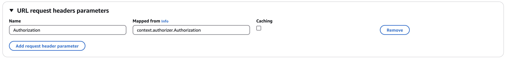
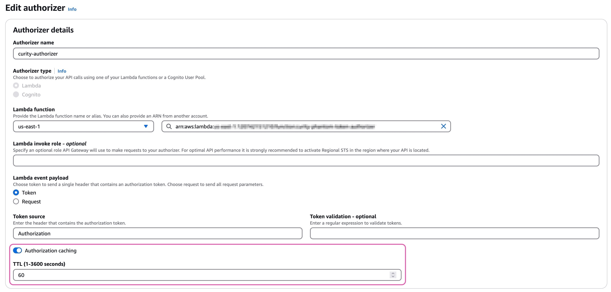

# AWS Phantom Token Lambda Authorizer

An AWS Lambda Authorizer implementing the [Phantom Token Pattern](https://curity.io/resources/learn/phantom-token-pattern/). This Lambda Authorizer function enables a secure API solution using the AWS API Gateway.

## Overview

The AWS API Gateway does not have built-in capabilities for introspecting opaque access tokens. It is however possible to extend the capabilities of the gateway with [Lambda Authorizer functions](https://docs.aws.amazon.com/apigateway/latest/developerguide/apigateway-use-lambda-authorizer.html).

The AWS Phantom Token Lambda Authorizer implements the Phantom Token Pattern. An opaque access token is passed in the Authorize header to the gateway. The gateway invokes the authorizer that will introspect the token using the `application/jwt` header in order to receive a JWT in the response.

The authorizer can also be configured to verify that a set of required scopes are present in the `scope` claim in the JWT or otherwise deny access to the requested API.

With a minor configuration the AWS API Gateway will forward the JWT from the introspection response in the `Authorize` header to the upstream API enabling a Zero Trust approach. The API in itself could also be leverage a Zero Trust design where the JWT holds the public key details for self-contained JWT verification as exemplified in this [Serverless API](https://github.com/curityio/serverless-zero-trust-api).

## Building the Lambda Authorizer

1. Clone the repository.
2. Update `.env` with the correct parameters. See the [Configuration](#Configuration) section for details.
3. Run `npm run package`. This will generate `aws-phantom-token-plugin.zip` in the current directory.

## Deploying the Lambda Authorizer

After building the authorizer, `aws-phantom-token-plugin.zip` can be uploaded and deployed as a Lambda Function in the AWS Console.

1. Choose `Create function`
2. Select the `Author from scratch` option, set a function name (ex. `curity-phantom-token-authorizer`), choose the `Node.js 22.x` runtime and `x86_64` as the architecture.
3. Click `Create function` 
4. The default `Hello from Lambda` code is displayed. Choose `Upload from` and from the drop-down select `.zip file`. Browse to `aws-phantom-token-plugin.zip` and upload the file.
5. Click `Deploy` to deploy the Lambda function

## Configuration

An `.env` file is bundled with the packaged authorizer before deployment. 

Parameter | Description |
--------- | ----------- |
HOST | The hostname of the Curity Identity Server
INTROSPECTION_PATH | The introspection path (`/oauth/v2/oauth-introspect`)
PORT | The runtime port of the Curity Identity Server
SCOPE | Required scopes for API access (space separated string)
CLIENT_ID | The client_id of a client with the `introspection` capability
CLIENT_SECRET | The secret of the client with the `introspection` capability

### Add JWT to Authorization header

The JWT from the introspection response should be forwarded to the upstream API. 

For the API protected, go to `Integration Request`, click `Edit`, expand the `URL request headers parameters` and add a header named `Authorization` that is mapped from `context.authorizer.Authorization`.

### Enable Authorization caching

The Authorizer returns an AWS IAM Policy that allows or denies the request. The IAM Policy can be cached by the API Gateway to optimize performance. If the same opaque token is sent in the request the API Gateway will look up the cached IAM Policy and the Authorizer will not be executed resulting in no introspection call to the Curity Identity Server.

## More Information

* Please visit [curity.io](https://curity.io/) for more information about the Curity Identity Server.
* [Use API Gateway Lambda authorizers](https://docs.aws.amazon.com/apigateway/latest/developerguide/apigateway-use-lambda-authorizer.html)

Copyright (C) 2021 Curity AB.